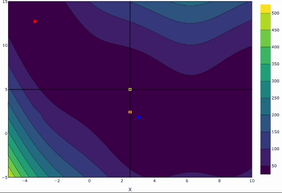
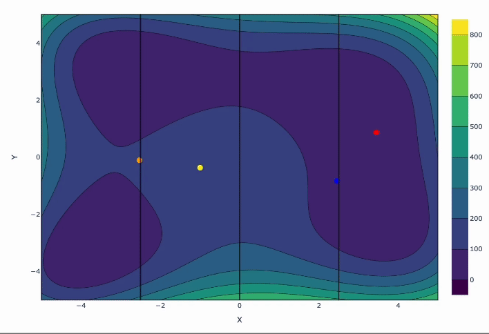

# Multi Agent Rollout for Bayesian Optimization 
Solving black-box global optimization problems efficiently across domains remains challenging especially for large scale optimization problems. Bayesian optimization has obtained important success as a black box optimization technique based on surrogates, but it still suffers when applied to large scale heterogeneous landscapes. Recent approaches have proposed non-myopic approximations and partitioning of the input domain into subregions to prioritize regions that capture important areas of the solution space. A Multi Agent Rollout formulation of Bayesian optimization (MAroBO) that partitions the input domain among finite set of agents for distributed sampling is proposed. This is the official implementation of MAroBO.

## Illustration
<p float="left">
  
  
</p>


## Installation

We use the Poetry tool which is a dependency management and packaging tool in Python. It allows you to declare the libraries your project depends on and it will manage (install/update) them for you. Please follow the installation of poetry at https://python-poetry.org/docs/#installation

After you've installed poetry, you can install all the dependencies by running the following command in the root of the project:

```
poetry install
```

## Running Demos

```
poetry run python demos/test_1d.py
```

Look at the tests for more details.

### FYI

Output receives a dictionary containing ```history``` and ```optimization_time```.